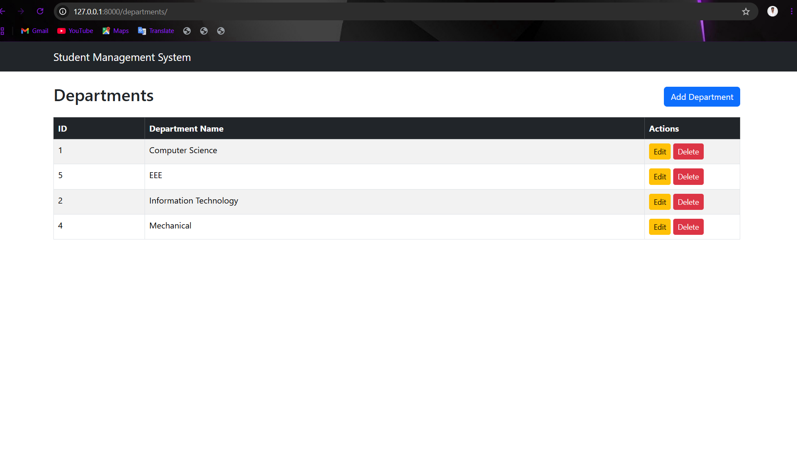
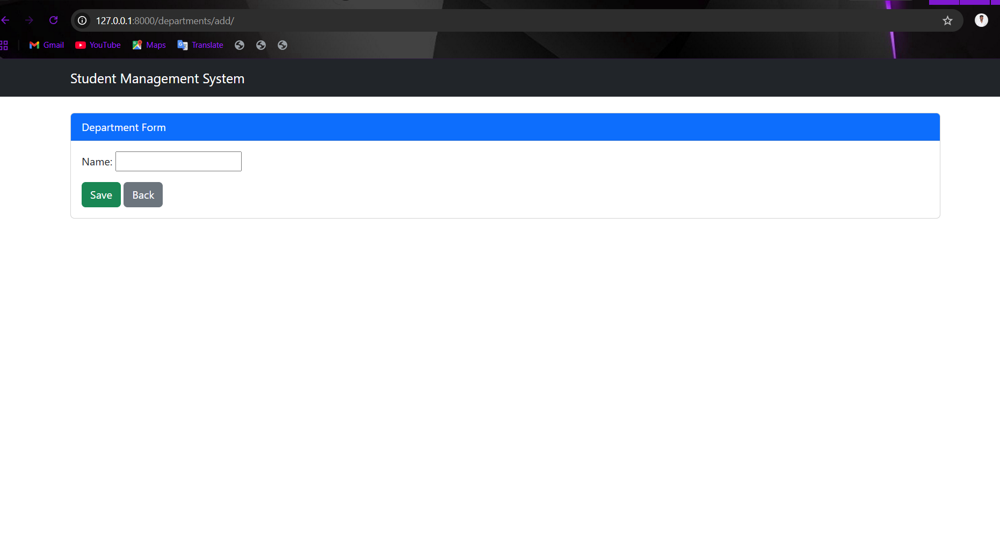
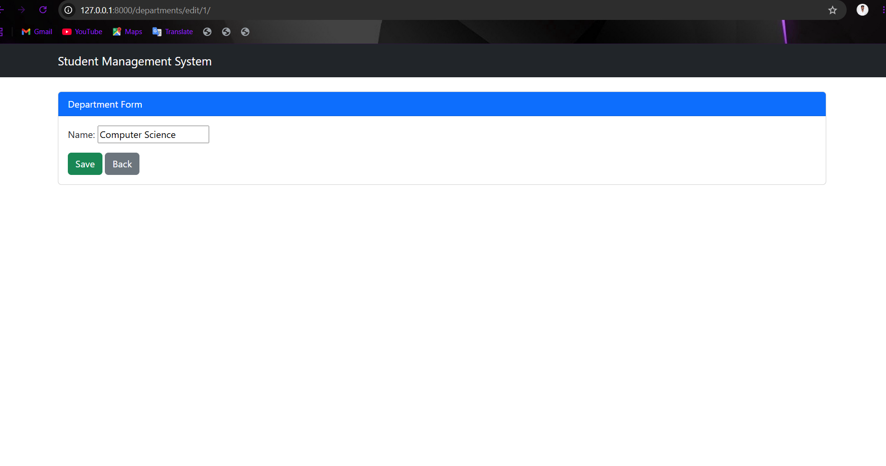
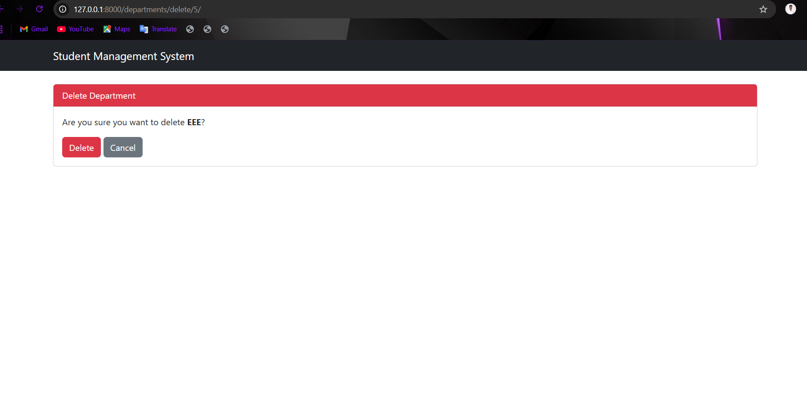
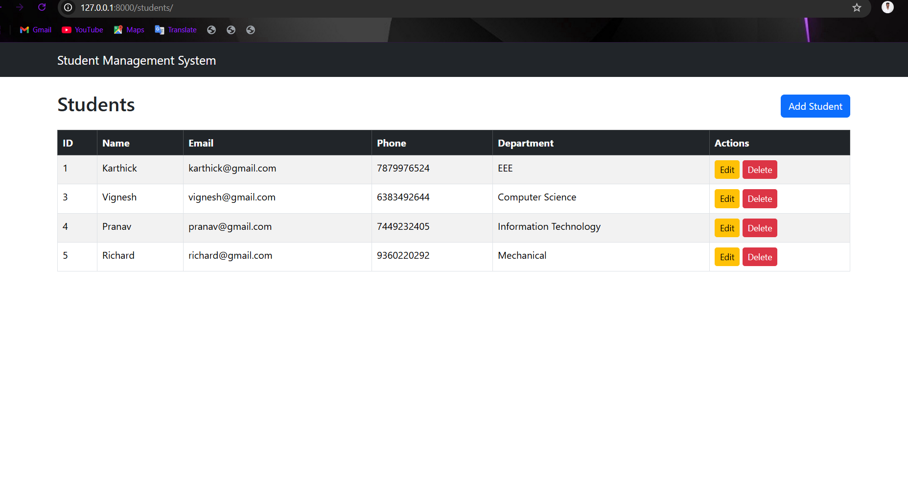
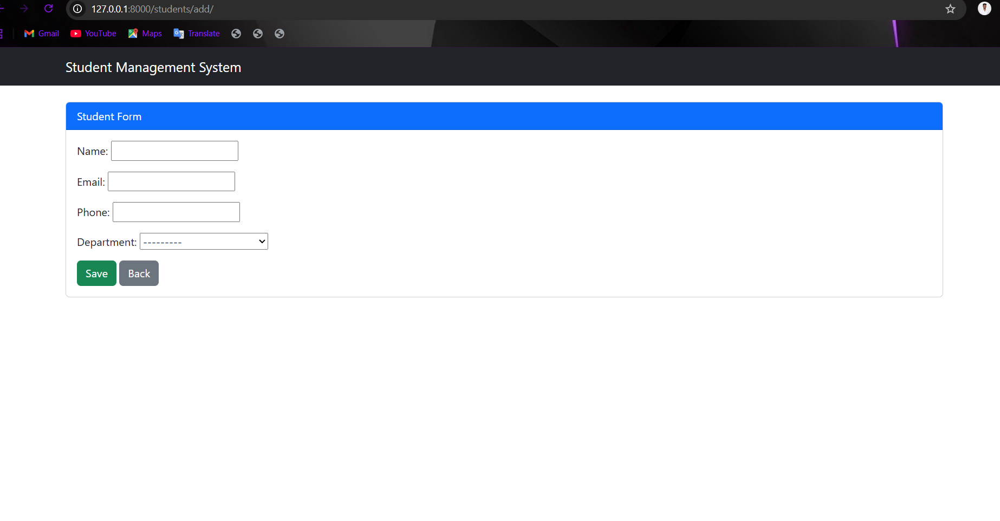
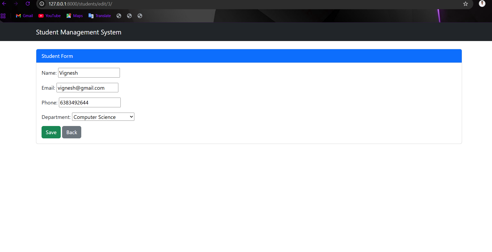
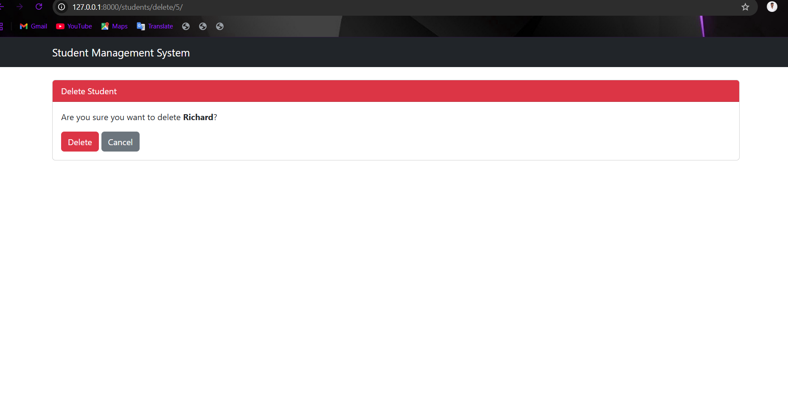

# Student Management System

A web-based Student Management System built using Django and MySQL.

## Features

### Department Module
- Add Department
- View Departments
- Edit Department
- Delete Department

## Technologies Used

- Python
- Django
- MySQL
- HTML
- CSS
- Bootstrap 5

## Installation

```bash
git clone <repository-url>
cd StudentManagementSystem

python -m venv venv

venv\Scripts\activate

pip install -r requirements.txt

python manage.py migrate

python manage.py createsuperuser

python manage.py runserver
```

## Screenshots

## Department Module

### Department List



---

### Add Department



---

### Edit Department



---

### Delete Department



## Student Module

### Student List



### Add Student



### Edit Student



### Delete Student



## Author

Vignesh R